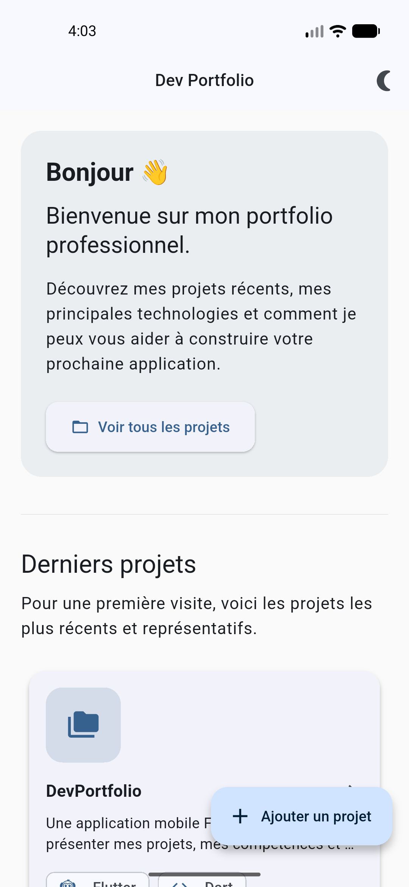
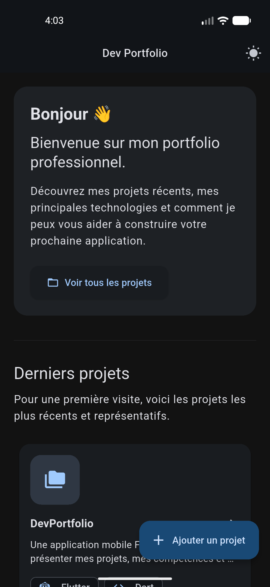
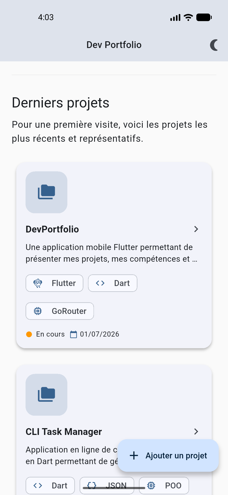
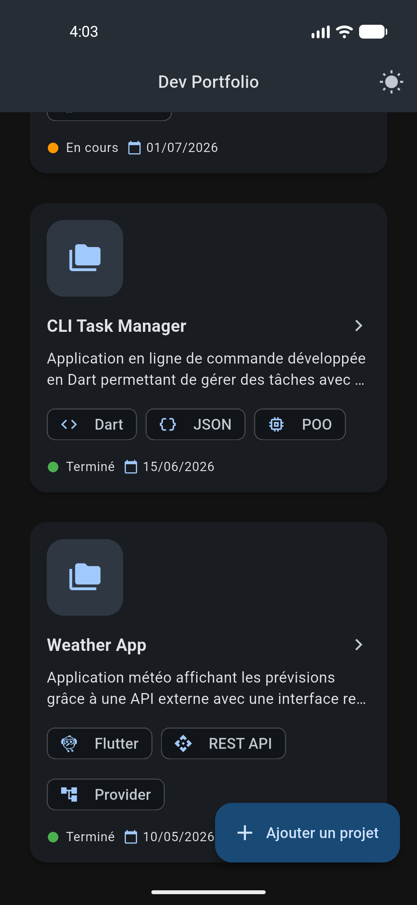
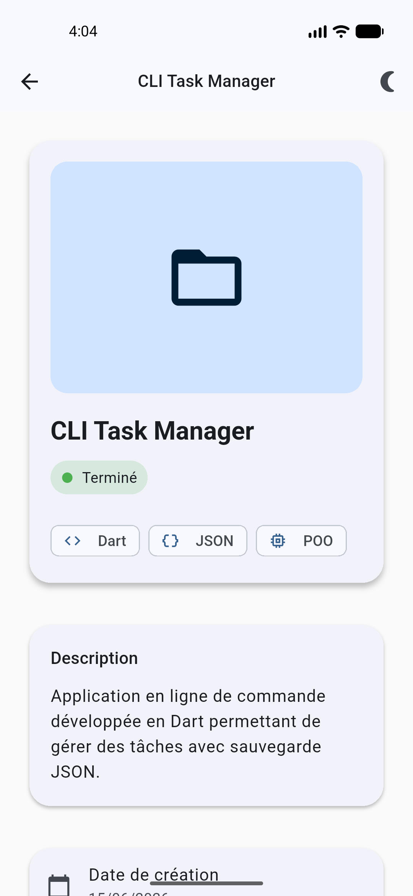
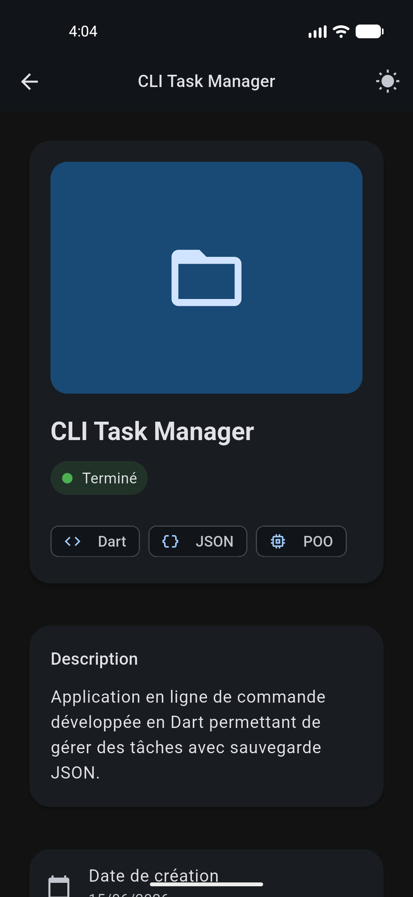
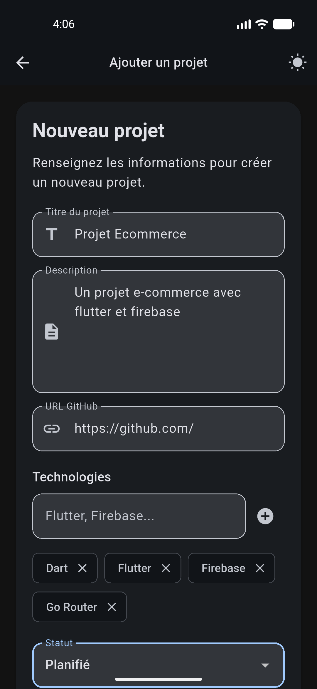
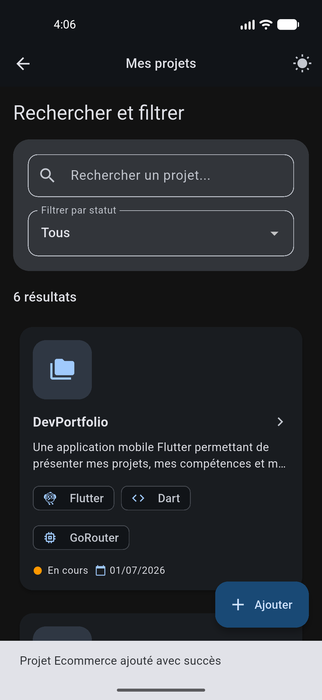

# Dev Portfolio

Ce projet est un portfolio d'applications Flutter conçu pour présenter des projets, naviguer entre les détails, rechercher et filtrer les projets, et ajouter de nouveaux projets localement.

## Fonctionnalités

- Écran d'accueil avec un message de bienvenue et aperçu des derniers projets.
- Liste de projets avec recherche par titre/description/technologie.
- Filtrage des projets par statut (`Completed`, `In Progress`, `Planned`).
- Affichage responsive en liste ou grille selon la taille d'écran.
- Détail de projet avec statut, technologies, date de création et lien GitHub cliquable.
- Formulaire d'ajout de projet local avec saisie de technologies et validation.
- Thème clair / sombre basculable depuis l'AppBar.
- Navigation fluide gérée par `go_router`.
- Gestion d'état centralisée via `provider`.

## Structure du projet

- `lib/main.dart`
  - Point d'entrée de l'application.
  - Initialise `ProjectProvider` et `MaterialApp.router`.

- `lib/router/app_router.dart`
  - Définit les routes principales de l'application :
    - `/` : `HomeScreen`
    - `/projects` : `ProjectsScreen`
    - `/project/:id` : `ProjectDetailScreen`
    - `/add` : `AddProjectScreen`

- `lib/screens/`
  - `home_screen.dart` : page d'accueil avec résumé des projets récents.
  - `projects_screen.dart` : liste des projets, recherche, filtre par statut, affichage listé ou en grille.
  - `project_detail_screen.dart` : détails du projet sélectionné avec CTA GitHub.
  - `add_project_screen.dart` : formulaire de création de nouveau projet avec technologies dynamiques.

- `lib/widgets/`
  - `portfolio_scaffold.dart` : structure commune avec barre d'application, bouton thème et retour.
  - `project_card.dart` : carte projet réutilisable pour les vues liste et grille.
  - `search_bar_widget.dart` : composant de recherche réutilisable.
  - `technology_chip.dart` : puce stylisée pour afficher les technologies.

- `lib/utils/`
  - `responsive_layout.dart` : utilitaire pour détecter mobile / tablette / desktop.

- `lib/data/project_data.dart`
  - Contient les données locales de projets utilisées au démarrage.

- `lib/models/`
  - `project.dart` : modèle de données d'un projet avec sérialisation JSON.
  - `project_status.dart` : définition des statuts de projet et labels associés.

- `lib/theme/app_theme.dart`
  - Définit les thèmes clair et sombre.
  - Gère le basculement de thème via `ValueNotifier<ThemeMode>`.

## Dépendances principales

- `go_router` : navigation déclarative.
- `provider` : gestion d'état avec `ChangeNotifier`.
- `intl` : formatage de dates.
- `url_launcher` : ouverture de liens GitHub externes.

## Installation et lancement

1. Clonez le dépôt GitHub :
   ```bash
   git clone https://github.com/myhrindra194/dev_portfolio.git
   ```

2. Placez-vous dans le dossier du projet :
   ```bash
   cd 'dev_portfolio'
   ```

3. Vérifiez que Flutter est installé et configuré :
   ```bash
   flutter --version
   ```

4. Installez les dépendances :
   ```bash
   flutter pub get
   ```

5. Lancez l'application sur un émulateur ou un appareil connecté :
   ```bash
   flutter run
   ```

6. Pour analyser le projet :
   ```bash
   flutter analyze
   ```

7. Pour exécuter les tests :
   ```bash
   flutter test
   ```

## Aperçu

Voici quelques captures d'écran de l'application :

<!-- Paires Light / Dark pour les écrans principaux -->
<table>
  <tr>
    <td align="center"><strong>Home (Light)</strong></td>
    <td align="center"><strong>Home (Dark)</strong></td>
    <td align="center"><strong>Projects (Light)</strong></td>
    <td align="center"><strong>Projects (Dark)</strong></td>
  </tr>
  <tr>
    <td></td>
    <td></td>
    <td></td>
    <td></td>
  </tr>
  <tr>
    <td align="center"><strong>Details (Light)</strong></td>
    <td align="center"><strong>Details (Dark)</strong></td>
    <td align="center"><strong>Add (Light)</strong></td>
    <td align="center"><strong>Add (Dark)</strong></td>
  </tr>
  <tr>
    <td></td>
    <td></td>
    <td></td>
    <td></td>
  </tr>
</table>

## Remarques

- Ce portfolio fonctionne principalement avec des données locales définies dans `lib/data/project_data.dart`.
- Le formulaire d'ajout de projet ajoute les projets via le `ProjectProvider` pour garder l'état centralisé.
- Le détail de projet permet d'afficher un statut, des technologies et un lien GitHub.
- Les liens GitHub s'ouvrent dans le navigateur avec `url_launcher`.

## À personnaliser

- Ajouter un stockage persistant pour sauvegarder les projets.
- Étendre les écrans avec des images, des captures d'écran ou du média enrichi.
- Ajouter un tri et un filtrage plus avancés pour les projets.

## Architecture technique

- **Entrée**: `lib/main.dart` initialise l'application, le `ProjectProvider` et le routeur.
- **Navigation**: `go_router` via `lib/router/app_router.dart`.
- **Écrans**: composants sous `lib/screens/` (Home, Projects, ProjectDetail, Add).
- **Widgets réutilisables**: sous `lib/widgets/` (`ProjectCard`, `PortfolioScaffold`, `SearchBarWidget`, `TechnologyChip`).
- **Utilitaires**: `lib/utils/responsive_layout.dart` gère les breakpoints mobile / tablette / desktop.
- **État**: `lib/providers/project_provider.dart` centralise l'ajout, la suppression et la mise à jour des projets.
- **Données**: données locales dans `lib/data/project_data.dart`.

## Widgets utilisés

- `PortfolioScaffold`: structure commune avec AppBar, bouton de retour et bascule thème.
- `ProjectCard`: aperçu d'un projet dans la liste ou la grille.
- `SearchBarWidget`: champ de recherche réutilisable.
- `TechnologyChip`: puce de technologie avec icône.
- `ResponsiveLayout`: utilitaire pour détecter la taille d'écran et adapter l'affichage.

## Provider, responsivité et tests

- Le `ProjectProvider` expose une liste en lecture seule et permet d'ajouter, supprimer et mettre à jour des projets avec `notifyListeners()`.
- Les écrans utilisent `context.watch()` et `context.read()` pour maintenir une architecture propre.
- La logique responsive repose sur `MediaQuery` via `lib/utils/responsive_layout.dart`.
- Les tests unitaires et widgets sont regroupés dans `test/` et exécutés automatiquement via GitHub Actions.

## Workflow GitHub Actions

Le workflow défini dans `.github/workflows/flutter.yml` installe Flutter, exécute `flutter pub get`, `flutter analyze` puis `flutter test` à chaque push et pull request.

## Prochaines améliorations

- Persistance locale (Hive / SharedPreferences / SQLite).
- Tests d'intégration et couverture complète.
- Export d'un CSV des projets.

